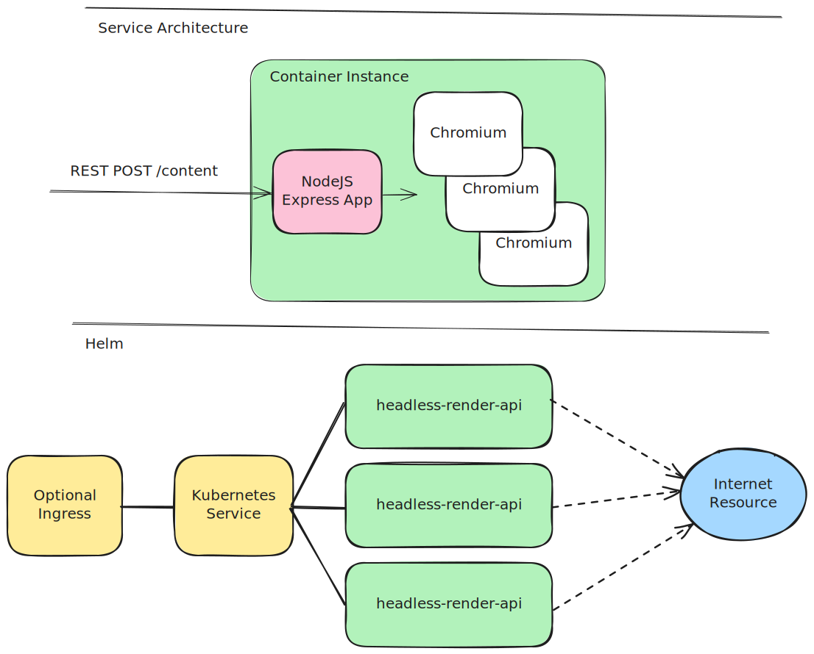

# headless-render-api
A simple headless browser service for rendering dynamic web content. Playwright and Express, deployable with Helm.

This service uses Playwright to render web pages, making it suitable for scraping dynamic content that relies on JavaScript. 
It is built with Express.js and can be deployed using Helm charts.

Playwright launches Chromium in headless mode to fetch and render web pages.

Inspired by fuller headless services (with strict licencing) such as:
- [Browserless](https://www.browserless.io/)
- [AeroKube Moon](https://aerokube.com/moon/)

## Features
- Render dynamic web content using a headless Chromium browser.
- Simple REST API with endpoints for content rendering, health checks, and metrics.
- Dockerized for easy deployment.
- Helm chart for Kubernetes deployment with HPA support.
- ARM64 and AMD64 support.



### Future features
If you find this useful, please raise an issue or PR with any features you would like to see!
Examples include:
- Persistent sessions 
- Exposing [CDP](https://chromedevtools.github.io/devtools-protocol/) sessions to a remote client
- Proxy support

## Endpoints
### `POST /content`
- Request Body: `{ "url": "https://example.com" }`
- Response: `{ "statusCode": 200, "content": "<!doctype html>...</html>" }`

Will return the HTML used to render the page after all network requests have completed.
This will show the fully rendered HTML, including any dynamic content loaded via JavaScript.

> Note: If you request an image directly, it will return the HTML for the browsers image page, not the image itself.

### `GET /health`

### `GET /metrics`


## Resource Requirements
Memory Requirements - TODO

Concurrency - Memory and CPU dependent on the host machine, but should be possible to get 10-20 concurrent requests per pod.

## Usage
Launch the docker locally with `docker compose build` and `docker compose up --watch`.

Use the test files in the `http` directory to test the endpoints as needed.

An example using curl:
```bash
curl -X POST http://localhost:3000/content -H "Content-Type: application/json" -d '{"url": "https://example.com"}'

{
  "statusCode": 200,
  "content": "<!doctype html>...</html>"
}
```

## Deploying with Helm
The application can be deployed using the included minimal helm chart, or by using the Docker image in your own helm charts.
The provided helm chart provides a simple stateless service with basic resource requests and limits.

The HPA is configured to scale between 1 and 3 replicas based on CPU usage, with a target average CPU utilization of 60%.

```
helm lint ./helm
helm install headless-render-api ./helm
```

Or using a Chart dependency:
```yaml
apiVersion: v2
name: my-chart
description: A Helm chart
type: application
version: 1.0.0
appVersion: "1.0.0"

dependencies:
  - name: headless-render-api-chart
    alias: headless-render-api
    version: ^1.0.0
    repository: oci://ghcr.io/martysweet
```

```
headless-render-api:
  ingress:
    enabled: true
    ...
```

## Testing Concurrency
You can use Apache Benchmark (ab) to test the concurrency of the headless-render-api. 
The following command sends 20,000 requests with a concurrency level of 200 to the `/content` or `/metrics` endpoint, posting JSON data with a URL to be rendered.
It fetches from itself, as to not overload any external sites.
```bash
echo '{"url": "http://localhost:3000/health"}' > /tmp/post_data.json && ab -n 200 -c 10 -p /tmp/post_data.json -T application/json http://localhost:3000/content
```